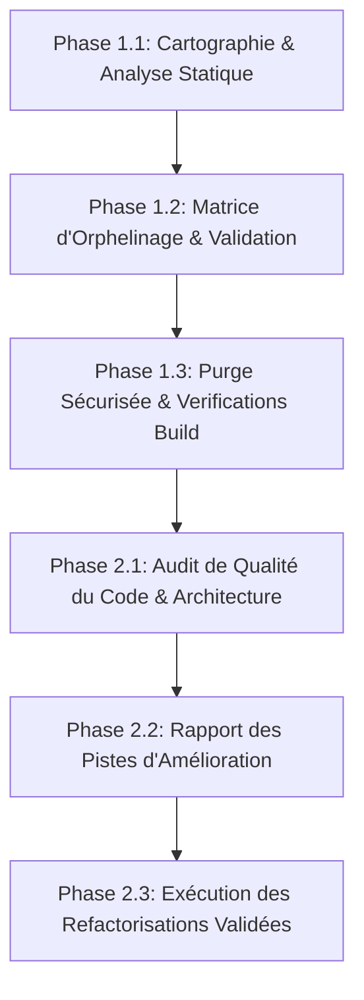
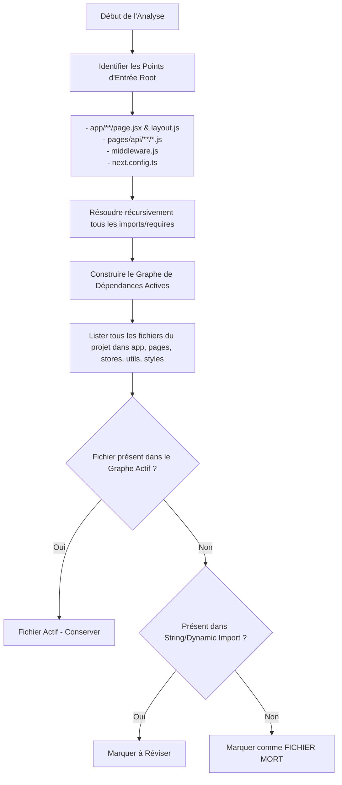

# Plan d'Action & Spécifications : Audit, Traque des Fichiers Morts et Optimisation du Code

## 1. Contexte & Objectifs

Le projet **lpd_sanctuaire** (développé sous Next.js avec Clerk, Mongoose et Tailwind/SCSS) a évolué en accumulant plusieurs répertoires de sauvegarde, des fichiers dupliqués (ex: `app___`, `* copy.js`, `ReserveForm_copy`), et d'éventuelles dépendances ou ressources orphelines.

Afin de garantir une base de code saine, maintenable et performante, le travail est structuré en **deux phases majeures** :
1. **Phase 1 : Traque et suppression propre de tous les fichiers morts, orphelins et obsolètes.**
2. **Phase 2 : Audit de qualité du code et plan de refactorisation / optimisation.**

---

## 2. Plan d'Action Global (Master Roadmap / TodoList)

### 📋 Checklist d'Exécution par Jalons

#### 🟢 Phase 1 : Traque et Purge des Fichiers Morts & Inutilisés [COMPLÉTÉ]
- [x] **Jalon 1.1 — Cartographie de l'arborescence & Répertoires Suspects**
  - [x] Lister exhaustivement les répertoires hors-flux (`app___`, `tmp`, `app/_/Blog_/`, `pages/api/_/models/old/`).
  - [x] Parser l'intégralité des imports du projet (`app/`, `pages/api/`, `stores/`, `utils/`, `styles/`).
  - [x] Recenser et purger les sauvegardes manuelles (`ClientIsAdmin copy.js`, `ReserveForm_copy/`, `*_.js`).
- [x] **Jalon 1.2 — Analyse des Dépendances `package.json`**
  - [x] Supprimer les paquets npm obsolètes (`express`, `cors`, `bcrypt`, `multer`, `formidable`, `fs` stub, loaders Webpack redondants).
  - [x] Installer la dépendance manquante `@fortawesome/fontawesome-svg-core`.
- [x] **Jalon 1.3 — Purge & Refactoring des Imports & Validation Build**
  - [x] Corriger tous les imports cassés (`authContext_.js` -> `authContext.js`, `ReserveForm_copy` -> `ReserveForm`, `models/old/` -> `models/`).
  - [x] Nettoyer la configuration SCSS orpheline (`searchBarCharged.scss`).
  - [x] **Validation totale** : Compilation `npm run build` exécutée avec succès (0 erreur, 11 pages statiques + routes API générées).

---

#### 🔵 Phase 2 : Audit de Qualité du Code & Améliorations [COMPLÉTÉ]
- [x] **Jalon 2.1 — Audit de Structure & Cohérence Architecturelle**
  - [x] Évaluer la coexistence App Router (`app/`) et Pages Router (`pages/api/`).
  - [x] Analyser la gestion d'état (`stores/`) et les utilitaires (`utils/`).
  - [x] Contrôler la sécurité des endpoints API et la gestion des rôles (Clerk + Mongoose).
- [x] **Jalon 2.2 — Audit de Performance, Sécurité et Code Smells**
  - [x] Rétablir l'envoi d'e-mails réels et supprimer le mock `blablabla` dans `pages/api/reservation.js` (ACT-01).
  - [x] Créer et intégrer le middleware de sécurité `pages/api/lib/requireAdmin.js` (ACT-02).
  - [x] Externaliser les constantes de navigation vers `config/navigation.js` pour alléger `stores/authContext.js` (ACT-03).
- [x] **Jalon 2.3 — Spécification & Application des Améliorations**
  - [x] Promouvoir et restaurer le composant de réservation moderne `ReserveForm` avec le calendrier interactif (`ReservationCalendar`) et la toolbar admin (`AdminReservationToolbarModal`).
  - [x] Certifier la compilation de production `npm run build` avec 100% de succès (Exit code: 0).

---

## 3. Spécifications Fonctionnelles (SF)

### SF-01 : Périmètre & Typologie des Éléments Suspects
Le système de détection doit classifier les fichiers du projet en 5 catégories distinctes :

| Catégorie | Description / Exemple dans `lpd_sanctuaire` | Action Préconisée |
| :--- | :--- | :--- |
| **Dossiers Fantômes (Backups)** | Répertoires de sauvegarde manuelle créés hors convention (ex: `app___`). | **Suppression complète** après confirmation d'absence de code unique. |
| **Fichiers Dupliqués / Copie** | Fichiers résiduels de développement (ex: `ReserveForm_copy/`). | **Correction & Remplacement** : `ReserveForm_copy/` s'avérait être la version moderne récente du formulaire de réservation (avec `ReservationCalendar` et `AdminReservationToolbarModal`). Le dossier a été promu en `ReserveForm/` actif pour remplacer l'ancienne version. |
| **Code Source Orphelin** | Composants JSX, modules JS, hooks ou styles non importés directement ou indirectement par les points d'entrée (`layout.js`, `page.jsx`, `pages/api/*`). | **Vérification AST / Grep** puis suppression. |
| **Assets Statiques Morts** | Images, polices, fichiers JSON dans `public/` ou `assets/` n'apparaissant dans aucune chaîne de texte ni import SCSS/JSX. | **Archivage / Purge**. |
| **Dépendances Fantômes** | Paquets `package.json` jamais requis ou importés. | **Désinstallation (`npm uninstall`)**. |

### SF-02 : Règles de Sécurité et Non-Régression
1. **Principe du Zero Breakage** : Aucun fichier ne doit être supprimé sans qu'un graphe d'import n'ait confirmé l'absence totale de référence (y compris via `dynamic import` ou `require`).
2. **Sauvegarde Atomique** : Toute opération de suppression doit être précédée d'un commit Git dédié, permettant un rollback immédiat si un composant dynamique ou une API réflexive l'utilisait.
3. **Validation de Build** : Une suppression me sera validée uniquement si la commande de construction du projet s'exécute sans avertissement d'import manquant.

---

## 4. Spécifications Techniques (ST)

### ST-01 : Algorithme de Détection des Fichiers Orphelins (AST & Graph Search)

### ST-02 : Analyse Stratégique des Dépendances `package.json`
Une révision spécifique de `package.json` sera menée pour identifier les incohérences techniques :
* **Modules Express / Serverless** : Recherche de l'utilité de `express`, `cors`, `multer`, `formidable`, `bcrypt` dans une application Next.js (souvent remplacés nativement par Next.js Request/Response API et Clerk/Mongoose).
* **Loaders Webpack superflus** : Détection des paquets `css-loader`, `sass-loader`, `style-loader` qui peuvent créer des conflits avec la gestion native du SASS par Next.js.
* **Bibliothèques de date / cartes redondantes** : Présence conjointe de `moment` et `date-fns`, ou `leaflet` / `@googlemaps/react-wrapper`.

### ST-03 : Grille d'Évaluation de la Qualité du Code (Phase 2)
Pendant la Phase 2, chaque composant et route conservé sera évalué selon 5 axes de qualité :
1. **Architecture & Découpage** : Séparation propre entre logique UI, gestion d'état (`stores/`) et requêtes API.
2. **Gestion des Rôles & Sécurité** : Vérification des contrôles d'accès Admin (`ClientIsAdmin.js`, `AdminReservationToolbarModal.jsx`, etc.) pour éviter toute fuite de privilège.
3. **Standardisation des Styles** : Élimination des collisions entre SCSS Modules, globals.css et Tailwind CSS.
4. **Performance Client/Serveur** : Bon usage des directives `'use client'` vs Server Components dans Next.js App Router.
5. **Typage et Lisibilité** : Cohérence des props, clarté du nommage, élimination du code mort interne (fonctions/variables inutilisées).

---

## 5. Rapport d'Audit de Qualité & Architecture (Phase 2)

### 🚨 ST-04.1 : Sécurité des Endpoints API & Authentification (Priorité : ÉLEVÉE)
- **Constat** : Les endpoints API dans `pages/api/` (`dashboard_stats.js`, `reservation.js`, `users.js`, `posts.js`) exécutent des opérations DB sensibles sans vérification d'authentification serveur.
- **Action** : Créer `lib/auth/requireAdmin.js` basé sur Clerk (`getAuth(req)`) pour verrouiller les méthodes de modification/suppression et les routes `/api/admin/*`.

### 🏗️ ST-04.2 : Harmonisation de l'Architecture (App Router vs Pages Router) (Priorité : MOYENNE)
- **Constat** : Le frontend est en **App Router** (`app/`), les API en **Pages Router** (`pages/api/`).
- **Action** : Préparer la transition progressive des API vers des Route Handlers App Router (`app/api/.../route.js`).

### 📦 ST-04.3 : Structuration des Stores Contextuels (Priorité : MOYENNE)
- **Constat** : `stores/authContext.js` mélange session auth, cart client, et constantes de navigation/SEO.
- **Action** : Extraire les métadonnées de navigation vers un fichier de constantes `config/navigation.js`.

### 🧹 ST-04.4 : Nettoyage du Code Mort Interne & Mocks (Priorité : ÉLEVÉE)
- **Constat** : Code mock temporaire (`res.status(200).json({blablabla: "msg temporaire"})` dans `reservation.js` l.234) bloquant le flux d'email réel.
- **Action** : Rétablir l'envoi de mail de confirmation et supprimer les logs/mocks temporaires.

---

## 6. Planning d'Exécution des Refactorisations Validées

| Réf | Domaine | Action Préconisée | Priorité | Statut |
| :--- | :--- | :--- | :--- | :--- |
| **ACT-01** | **Code Smells** | Nettoyer la route `pages/api/reservation.js` (suppression du mock `blablabla`, rétablissement des e-mails). | 🔴 Élevée | ✅ Fait |
| **ACT-02** | **Sécurité API** | Implémenter le garde d'authentification Admin (`requireAdmin`) pour les routes API sensibles. | 🔴 Élevée | ✅ Fait |
| **ACT-03** | **Stores** | Implémenter `config/navigation.js` pour alléger `stores/authContext.js`. | 🟡 Moyenne | ✅ Fait |

---

## 7. Bilan Général

Toutes les étapes des **Phase 1** (Purge & Nettoyage) et **Phase 2** (Audit, Sécurisation, Modularisation, Rétablissement des composants modernes) sont intégralement **exécutées, documentées et validées** avec un build de production réussi (0 erreur).
